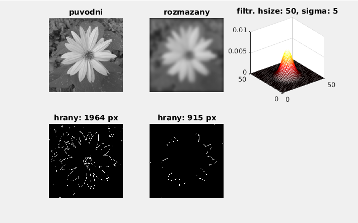

# Image sharpness detection and autofocus 

>This document works with an [image](media/kytka256.jpg) in `A` variable and a [video](media/podzimni_kvetena_focus_test.mp4) in `v` variable.
 If you have MATLAB2015a or newer version, use *imgaussfilt(A, sigma)* instead of *fspecial()* and *imfilter()*.

## detect image sharpness -> use edges to compare sharpness of 2 images

``` matlab

A = imread('kytka256.jpg');
A = rgb2gray(A);

hsize = 50; 
sigma = 5;
f = fspecial('gaussian',hsize,sigma);

Af = imfilter(A,f);
Ae =edge(A);
Aef =edge(Af);

s = 1;
cols = 3;
rows = 2;

subplot(rows,cols,s);s=s+1;imshow(A);title('original');
subplot(rows,cols,s);s=s+1;imshow(Af);title('filtered');
subplot(rows,cols,s);s=s+1;mesh(f);title(['filtr. hsize: ' num2str(hsize),', sigma: ' num2str(sigma)]);
colormap('hot')
subplot(rows,cols,s);s=s+1;imshow(Ae);title(['edges: ', num2str(sum(Ae(:))), ' px' ]);
subplot(rows,cols,s);s=s+1;imshow(Aef);title(['edges: ', num2str(sum(Aef(:))), ' px' ]);
```



## Autofocus – hledani nejostřejších snimku ve videu

``` matlab
v = VideoReader('podzimni_kvetena_focus_test.mp4');

vHeight = v.Height;
vWidth = v.Width;
```

### smerodatnou odchylku urcuji jen z prostredni ctvrtiny
```

centerX = [vHeight/4:vHeight*3/4];
centerY = [vWidth/4:vWidth*3/4];
```

### struktura pro nacitani jednotlivych framu

``` matlab
s = struct('frame',zeros(vHeight,vWidth,3,'uint8'));

k = 1;

A = [];

while hasFrame(v)

f = readFrame(v);

% ulozim frame

s(k).frame = f;

% soucet smerodatnych odchylek ve vyrezu framu

A = [A sum(sum(std(double(f(centerX,centerY)))))];

k = k+1;

end

[m,i] = max(A);

D = ['Nejostrejsi se zda byt ',num2str(i),'. snimek.'];

disp(D)

```

### zobrazeni nejostrejsiho snimku

```matlab

imshow(s(i).frame);

```

### generovani vysledku

``` matlab

w = VideoWriter('autofocus');

open(w);
```

### video jede kousek za nejostrejsi
``` matlab

for k = 1:i+10

writeVideo(w, s(k).frame);

end
```
### pak zpet k nemu
``` matlab

for k = 1:9

writeVideo(w, s(i+10-k).frame);

end
```
### a chvili na nem
``` matlab

for k = 1:9

writeVideo(w, s(i).frame);

end

close(w); 
```

